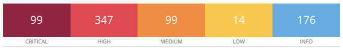
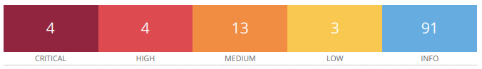

# Proyecto 4: Hunting Vulnerabilities

> *2 De Abril de 2024*

## Índice

1. [Resumen Ejecutivo](#resumen-ejecutivo)
2. [Introducción](#introducción)
    - [Alcance](#alcance)
    - [Objetivos](#objetivos)
3. [Metodología](#metodología)
4. [Resultados Obtenidos](#resultados-obtenidos)
    - [Servidor 1 - Windows](#servidor-1---windows)
    - [Servidor 2 - Linux](#servidor-2---linux)
5. [Conclusiones y Recomendaciones](#conclusiones-y-recomendaciones)
6. [Glosario de Términos](#glosario-de-términos)
7. [Referencias](#referencias)

## Resumen Ejecutivo

En este documento se presenta la evaluación del escaneo con credenciales de los dos servidores de la empresa contratante *SecureLogistics* por parte del equipo de seguridad de nuestra empresa NETMANCER Incorporated.

El presente análisis persigue el objetivo de determinar el número de problemas de seguridad existentes en los servidores de *SecureLogistics*, y medir la gravedad de estos, en el caso que llegaran a detectarse. Como resultado final, concluimos que se han hallado numerosos fallos de seguridad en ambos servidores. 

A continuación se presenta un gráfico resumen con vulnerabilidades encontradas en las máquinas clasificadas por severidad:

**Servidor 1 con sistema operativo Windows:**

- Puntuación CVSS más alta: **10**

**Servidor 2 con sistema operativo Linux:**

- Puntuación CVSS más alta: **10**

Teniendo en cuenta que una vulnerabilidad con una puntuación CVSS de 10 significa que, de explotarla, se alcanzaría un nivel de compromiso máximo en cuanto a la confidencialidad, integridad y disponibilidad de la información, podemos afirmar que estos dos servidores poseen efectivamente niveles absolutamente críticos de riesgo.

En el presente informe se detalla más información sobre los resultados obtenidos.

## Introducción

En el presente informe se nos solicitaba un análisis profundo de dos servidores de la infraestructura de *SecureLogistics*, haciendo uso de las credenciales de ambos servidores en los escaneos. El motivo presentado fue la sospecha de posibles problemas de seguridad y la necesidad de acotamiento de los mismos, para garantizar la máxima optimización de una posible inversión en la seguridad de la empresa.

Es por ello que ha decidido realizar un escaneo de los puertos más comunes con el propósito de detectar, si es que existen, las vulnerabilidades más frecuentes en los servidores indicados.

En este informe se realizará un análisis de las vulnerabilidades encontradas más importantes, así como una comparación con el escaneo de **caja negra** sin credenciales realizado previamente.

Las vulnerabilidades listadas en este documento se acompañarán de una breve descripción, y una evaluación usando la métrica de evaluación CVSS (*Common Vulnerability Scoring System*).

### Alcance

El alcance del mismo se extenderá a un escaneo de tipo ***caja blanca***, que consiste en inspeccionar y testear los puertos más comunes de la máquina, sirviéndonos de las credenciales de acceso.

### Objetivos

El principal objetivo de este informe es determinar mediante herramientas de escaneo la cantidad de vulnerabilidades en las dos máquinas especificadas por *SecureLogistics*, comparando el resultado con el análisis previo de caja negra. 

## Metodología

Para realizar los escaneos se hará uso de la herramienta análisis de vulnerabilidades automático *Nessus Tenable®*.

Esta herramienta realizará un test automático en los puertos vulnerables más comunes y realizará pruebas automatizadas de penetración basadas en las vulnerabilidades y brechas de seguridad más habituales registradas en su base de datos. Tras realizar el test, la misma herramienta generará un reporte que será utilizado para realizar un desglose de las posibles vulnerabilidades encontradas, las cuáles serán examinadas, descritas y evaluadas.

La métrica de evaluación será la proporcionad por CVSS 3.0, *un framework abierto y universalmente utilizado que establece unas métricas para la comunicación de las características, impacto y severidad de vulnerabilidades que afectan a elementos del entorno de seguridad IT* (Definición de INCIBE, 2023)

## Resultados Obtenidos

Podemos encontrar a continuación una lista en detalle de cada una de las vulnerabilidades encontradas para los servidores especificados.

Aquí se encontrará un pequeño desglose en forma de tabla por vulnerabilidad donde:

- _Gravedad_: indica el nivel de riesgo que implica que la vulnerabilidad esté presente
- _CVSSv3_: Es la puntuación dada según el framework CVSS versión 3.
- ID: Es el id del plugin de la herramienta _Nessus Tenable_ que ha sido usado para testear la vulnerabilidad. (Tenable®, 2024)

Y dos secciones asociadas que proporcionarán una **breve descripción** y **posible solución** a esa vulnerabilidad concreta. Además, se proporcionará una comparativa entre los dos escaneos, el de *caja negra* y el de *caja blanca*, resaltando las diferencias entre ambos, y examinando las vulnerabilidades más críticas e importantes.

## Servidor 1 - Windows

**Resumen gráfico de vulnerabilidades encontradas**

Debemos resaltar la gran cantidad de vulnerabilidades encontradas por el escáner _Nessus_, más concretamente 559 en total, valiéndose de las credenciales del servidor Windows. Debido al alto número encontrado, nos centraremos en mostrar las más relevantes de cada categoría, para luego llevar a cabo una comparación con las encontradas en el escaneo de caja negra.

### Nivel Crítico

#### MS12-075: Vulnerability in Windows Kernel-Mode Drivers Could Allow Remote Code Execution (2761226)

| Gravedad | CVSSv3 | ID     |
|----------|--------|--------|
| Critical | 10*    | [62907](https://www.tenable.com/plugins/nessus/62907)  |

**Descripción:** El host remoto con sistema operativo Windows está afectado por varias vulnerabilidades de ejecución remota de código (CVE-2012-2530, CVE-2012-2553, CVE-2012-2897).

**Solución:** Microsoft ha lanzado un conjunto de parches para Windows XP, 2003, Vista, 2008, 7, 2008 R2, 8 y 2012.

---

#### MS14-026: Vulnerability in .NET Framework Could Allow Elevation of Privilege (2958732)

| Gravedad | CVSSv3 | ID     |
|----------|--------|--------|
| Critical | 10*    | [73985](https://www.tenable.com/plugins/nessus/73985)  |

**Descripción:** El host remoto tiene una versión del Microsoft .NET Framework que está afectada por una vulnerabilidad de escalada de privilegios debido a la forma en que .NET Framework maneja las comprobaciones de TypeFilterLevel para algunos objetos malformados.

**Solución:** Microsoft ha lanzado un conjunto de parches para .NET Framework 1.1 SP1, 2.0 SP2, 3.5, 3.5.1, 4.0, 4.5 y 4.5.1.

---

#### MS14-035: Cumulative Security Update for Internet Explorer (2969262)

| Gravedad | CVSSv3 | ID     |
|----------|--------|--------|
| Critical | 10*    | [74427](https://www.tenable.com/plugins/nessus/74427)  |

**Descripción:** La versión de Internet Explorer instalada en el host remoto está afectada por varias vulnerabilidades, la mayoría de las cuales son vulnerabilidades de ejecución remota de código. 

**Solución:** Microsoft ha lanzado un conjunto de parches para Internet Explorer 6, 7, 8, 9, 10 y 11.

---

#### MS13-083: Vulnerability in Windows Common Control Library Could Allow Remote Code Execution (2864058)

| Gravedad | CVSSv3 | ID     |
|----------|--------|--------|
| Critical | 10*    | [70335](https://www.tenable.com/plugins/nessus/70335)  |

**Descripción:** El host remoto tiene una vulnerabilidad de desbordamiento de enteros en la Biblioteca de Controles Comunes de Windows, la cual podría podría permitir la ejecución remota de código si un atacante envía una solicitud web especialmente diseñada a una aplicación web ASP.NET que se esté ejecutando en un sistema afectado.

**Solución:** Microsoft ha lanzado un conjunto de parches para Windows 2003, XP, Vista, 2008, 7, 2008 R2, 8, 2012 y la opción de instalación de Server Core.

---

#### MS16-035: Security Update for .NET Framework to Address Security Feature Bypass (3141780)

| Gravedad | CVSSv3 | ID     |
|----------|--------|--------|
| Critical | 9.8    | [89757](https://www.tenable.com/plugins/nessus/89757)  |

**Descripción:** El host remoto tiene una vulnerabilidad que esquiva una característica de seguridad en el .NET Framework debido a una validación incorrecta de ciertos elementos en un documento XML firmado. Un atacante puede aprovechar esta vulnerabilidad para modificar el contenido de un archivo XML sin invalidar la firma asociada con el archivo.

**Solución:** Microsoft ha lanzado un conjunto de parches para .NET Framework 2.0 SP2, 3.0 SP2, 3.5, 3.5.1, 4, 4.5.1, 4.5.2, 4.6 y 4.6.1.

### Nivel Alto

#### MS15-020: Vulnerabilities in Microsoft Windows Could Allow Remote Code Execution (3041836) (EASYHOOKUP)

| Gravedad | CVSSv3 | ID     |
|----------|--------|--------|
| Critical | 8.8    | [81735](https://www.tenable.com/plugins/nessus/81735)  |

**Descripción:** El host remoto tiene instaladas varias vulnerabilidades de ejecución remota de código. Estas vulnerabilidades incluyen una vulnerabilidad de ejecución remota de código en Windows Text Services debido al manejo incorrecto de objetos en la memoria (CVE-2015-0059) y una vulnerabilidad de ejecución remota de código debido a la carga incorrecta de archivos DLL (CVE-2015-0096)(EASYHOOKUP).

**Solución:** Microsoft ha lanzado un conjunto de parches para Windows 2003, Vista, 2008, 7, 2008 R2, 8, 2012, 8.1 y 2012 R2.

---

#### MS16-005: Security Update for Windows Kernel-Mode Drivers to Address Remote Code Execution (3124584)

| Gravedad | CVSSv3 | ID     |
|----------|--------|--------|
| Critical | 8.8    | [87892](https://www.tenable.com/plugins/nessus/87892)  |

**Descripción:** El host remoto no tiene instalada una actualización de seguridad y, por lo tanto, está afectado dos importantes vulnerabilidades. La primera consiste en una vulnerabilidad de divulgación de información en la interfaz de dispositivo gráfico de Windows debido al manejo incorrecto de objetos en la memoria (CVE-2016-0008), mientras que la segunda es una vulnerabilidad de ejecución remota de código debido nuevamente al manejo incorrecto de objetos en la memoria (CVE-2016-0008).

**Solución:** Microsoft ha lanzado un conjunto de parches para Windows Vista, 2008, 7, 2008 R2, 8, RT, 2012, 8.1, RT 8.1, 2012 R2 y 10.

---

#### Insecure Windows Service Permissions

| Gravedad | CVSSv3 | ID     |
|----------|--------|--------|
| Critical | 8.4    | [65057](https://www.tenable.com/plugins/nessus/65057)  |

**Descripción:** Un ejecutable de servicio de Windows posee permisos inseguros en el servidor. Los servicios configurados para utilizar un ejecutable con permisos débiles son vulnerables a ataques de escalada de privilegios. Un usuario sin privilegios podría modificar o sobrescribir el ejecutable con código arbitrario, que se ejecutaría la próxima vez que se inicie el servicio.
Este plugin verifica si alguno de los siguientes grupos tiene permisos para modificar archivos ejecutables que son iniciados por servicios de Windows:

- Everyone
- Users
- Domain Users
- Authenticated Users

**Solución:** Comprobar que los grupos mencionados anteriormente no tengan permisos para modificar o escribir ejecutables de servicios, ni tengan permiso de Control Total sobre ningún directorio que contenga ejecutables de servicios.

---

#### Apache Struts CVE-2018-11776 Results With No Namespace Possible Remote Code Execution (S2-057)

| Gravedad | CVSSv3 | ID     |
|----------|--------|--------|
| Critical | 8.1    | [112036](https://www.tenable.com/plugins/nessus/112036) |

**Descripción:** La versión de Apache Struts que se está ejecutando en el servidor es 2.3.x antes de 2.3.35, o 2.5.x antes de 2.5.17 y contiene una vulnerabilidad de ejecución remota de código.

**Solución:** Actualizar a la versión 2.3.35 o 2.5.17 o posterior de Apache Struts.

---

#### MS16-032: Security Update for Secondary Logon to Address Elevation of Privilege (3143141)

| Gravedad | CVSSv3 | ID     |
|----------|--------|--------|
| Critical | 7.8    | [89755](https://www.tenable.com/plugins/nessus/89755)  |

**Descripción:** El servidor está afectado por una vulnerabilidad de elevación de privilegios en el Servicio de Inicio de Sesión Secundario de Windows debido a una gestión inadecuada de los identificadores de solicitud en la memoria, lo que permite a un atacante autenticado y remoto explotar esto, a través de una aplicación especialmente diseñada, para elevar privilegios, lo que a su vez permite la ejecución de código arbitrario.

**Solución:** Microsoft ha lanzado un conjunto de parches para Windows Vista, 2008, 7, 2008 R2, 2012, 8.1, RT 8.1, 2012 R2 y 10

### Nivel Medio

#### MS16-033: Security Update for Windows USB Mass Storage Class Driver to Address Elevation of Privilege (3143142)

| Gravedad | CVSSv3 | ID     |
|----------|--------|--------|
| Critical | 6.8    | [89779](https://www.tenable.com/plugins/nessus/89779)  |

**Descripción:** El servidor no tiene instalada una actualización de seguridad y, por lo tanto, está afectado por una vulnerabilidad de elevación de privilegios en el controlador de clase de almacenamiento masivo USB de Windows debido a una validación incorrecta de objetos en memoria, lo cual permitiría a un atacante local, a través de un dispositivo USB especialmente diseñado, elevar privilegios y ejecutar código arbitrario.

**Solución:** Microsoft ha lanzado un conjunto de parches para Windows Vista, 2008, 7, 2008 R2, 2012, 8.1, RT 8.1, 2012 R2 y 10.

---

#### MS17-016: Security Update for Windows IIS (4013074)

| Gravedad | CVSSv3 | ID     |
|----------|--------|--------|
| Critical | 6.1    | [97741](https://www.tenable.com/plugins/nessus/97741)  |

**Descripción:** El servidor carece de una actualización de seguridad y, por lo tanto, está afectado por una vulnerabilidad de cross-site scripting (XSS) debido a una validación incorrecta de la entrada proporcionada por el usuario. Esto puede ser aprovechado por un atacante remoto y no autenticado, a través de una solicitud especialmente diseñada para ejecutar código de script arbitrario en la sesión del navegador de un usuario.

**Solución:**  Microsoft ha lanzado un conjunto de parches para Windows Vista, 2008, 7, 2008 R2, 2012, 8.1, RT 8.1, 2012 R2, 10 y 2016.

---

#### MS16-065: Security Update for .NET Framework (3156757)

| Gravedad | CVSSv3 | ID     |
|----------|--------|--------|
| Critical | 5.9    | [91014](https://www.tenable.com/plugins/nessus/91014)  |

**Descripción:** Debido a la falta de una actualización de seguridad en el servidor, este se ve afectado por una vulnerabilidad de divulgación de información en el componente de encriptación de .NET Framework. Un atacante podría explotarla inyectando datos no encriptados en el canal seguro entre un cliente objetivo y un servidor legítimo, lo que le permite descifrar el tráfico SSL/TLS encriptado.

**Solución:** Microsoft ha lanzado un conjunto de parches para Microsoft .NET Framework 2.0 SP2, 3.5, 3.5.1, 4.5.2, 4.6 y 4.6.1.

---

#### HTTP TRACE / TRACK Methods Allowed

| Gravedad | CVSSv3 | ID     |
|----------|--------|--------|
| Critical | 5.3    | [11213](https://www.tenable.com/plugins/nessus/11213)  |

**Descripción:** El servidor admite los métodos TRACE y/o TRACK, los cuales son métodos HTTP que utilizados para depurar conexiones de servidor web.

**Solución:** Deshabilitar estos métodos HTTP.

---

#### Microsoft Windows LAN Manager SNMP LanMan Users Disclosure

| Gravedad | CVSSv3 | ID     |
|----------|--------|--------|
| Critical | 10*    | [10546](https://www.tenable.com/plugins/nessus/10546)  |

**Descripción:** Es posible obtener la lista de usuarios de LanMan en el host remoto mediante el envío de solicitudes SNMP con el OID 1.3.6.1.4.1.77.1.2.25.1.1.

**Solución:** Deshabilite el servicio SNMP en el host remoto si no lo utiliza, o filtre los paquetes UDP entrantes que van a este puerto.

### Nivel Bajo

#### SSH Server CBC Mode Ciphers Enabled

| Gravedad | CVSSv3 | ID     |
|----------|--------|--------|
| Critical | 3.7    | [70658](https://www.tenable.com/plugins/nessus/70658)  |

**Descripción:** El servidor SSH está configurado para admitir el cifrado Cipher Block Chaining (CBC). Esto puede permitir que un atacante recupere el mensaje en texto plano a partir del texto cifrado.

**Solución:** Deshabilitar el cifrado en modo CBC y habilitar el cifrado en modo CTR o GCM.

---

#### MS15-014: Vulnerability in Group Policy Could Allow Security Feature Bypass (3004361)

| Gravedad | CVSSv3 | ID     |
|----------|--------|--------|
| Critical | 3.3*   | [81267](https://www.tenable.com/plugins/nessus/81267)  |

**Descripción:** El servidor está afectado por una vulnerabilidad de degradación de seguridad que afecta a estaciones de trabajo y servidores configurados para usar Directiva de Grupo (Group Policy).

**Solución:** Microsoft ha lanzado un conjunto de parches para Windows 2003, Vista, 2008, 7, 2008 R2, 8, 2012, 8.1 y 2012 R2.

---

#### MS15-054: Vulnerability in Microsoft Management Console File Format Could Allow Denial of Service (3051768)

| Gravedad | CVSSv3 | ID     |
|----------|--------|--------|
| Critical | 1.9*   | [83363](https://www.tenable.com/plugins/nessus/83363)  |

**Descripción:** El servidor está afectado por una vulnerabilidad de denegación de servicio debido a una falla en la validación de un búfer de destino al recuperar información del icono de un archivo de Consola de Administración de Microsoft (.msc). Un atacante remoto y no autenticado, al engañar a una víctima para que abra un archivo .msc malicioso, puede aprovechar esta vulnerabilidad para causar una denegación de servicio.

**Solución:** Microsoft ha lanzado un conjunto de parches para Windows Vista, 2008, 7, 2008 R2, 8, 2012, 8.1 y 2012 R2.

### Análisis y Comparación

La comparación entre las vulnerabilidades identificadas en el escaneo de caja negra y el escaneo de caja blanca revela diferencias significativas en la cantidad y gravedad de los fallos de seguridad detectados.

En el análisis de caja negra, se encontraron un número limitado de vulnerabilidades críticas y altas. Estas vulnerabilidades podrían haber sido el resultado de un escaneo superficial que no pudo acceder a información privilegiada debido a la falta de credenciales de acceso.

En contraste, el escaneo de caja blanca, realizado con credenciales de acceso proporcionadas, reveló una amplia gama de vulnerabilidades críticas, altas y medias. Esta información adicional permitió una evaluación más exhaustiva del entorno de seguridad, revelando vulnerabilidades causadas por actualizaciones faltantes o versiones obsoletas de software.

La disponibilidad de credenciales de acceso permitió que el software de escaneo _Nessus_ accediera a información más detallada sobre el sistema operativo y las aplicaciones instaladas, lo que resultó en la identificación de una mayor cantidad de fallos de seguridad.

Algunas de las vulnerabilidades mencionadas son, por ejemplo, la KB5005089, KB4457145, KB4512486 o la KB5017373, que consisten en actualizaciones de seguridad no presentes en el servidor Windows.

Otras vulnerabilidades encontradas tienen relación con posibles ataques de denegación de servicio, protocolos débiles o mal configurados o ejecución remota de código malicioso.

## Servidor 2 - Linux
**Resumen gráfico de vulnerabilidades encontradas**

Si comparamos el resultado que vemos, con el obtenido por el escaneo de caja negra veremos una cantidad ligeramente superior de vulnerabilidades que en el mostrado en el informe de este último escaneo. Más concretamente, observamos la misma cantidad de vulnerabilidades de nivel bajo, pero un ligero aumento de los demás niveles, así como una cantidad de información significativamente superior.

A diferencia de lo sucedido con la compartiva entre ambos escaneos en el servidor Windows, no existe una diferenciación clave en los tipos de vulnerabilidades encontradas, sino simplemente un mayor número.

### Nivel Crítico

#### Unix Operating System Unsupported Version Detection

| Gravedad | CVSSv3 | ID     |
|----------|--------|--------|
| Critical | 10.0   | [33850](https://www.tenable.com/plugins/nessus/33850)  |

**Descripción:** Según su número de versión autoinformado, el sistema operativo Unix en el servidor remoto ya no cuenta con soporte.

**Solución:** Actualizar a una versión del sistema operativo Unix que esté actualmente soportada.

---

#### UnrealIRCd Backdoor Detection

| Gravedad | CVSSv3 | ID     |
|----------|--------|--------|
| Critical | 10.0   | [46882](https://www.tenable.com/plugins/nessus/46882)  |

**Descripción:** El servidor IRC remoto es una versión de UnrealIRCd con una puerta trasera que permite a un atacante ejecutar código arbitrario en el host afectado.

**Solución:** Vuelva a descargar el software, verifíquelo usando los valores de hash MD5 / SHA1 publicados y vuelva a instalarlo.

### Nivel Alto

#### Linux Sudo Privilege Escalation (Out-of-bounds Write)

| Gravedad | CVSSv3 | ID     |
|----------|--------|--------|
| Critical | 7.2    | [146799](https://www.tenable.com/plugins/nessus/146799)  |

**Descripción:** Sudo antes de la versión 1.9.5p2 tiene un desbordamiento de búfer basado en la asignación en el montón, lo que permite la escalada de privilegios a root a través de 'sudoedit -s' y un argumento de línea de comandos que termina con un solo carácter de barra invertida.

**Solución:** n/a.

---

#### Ubuntu 14.04 LTS : samba vulnerability (USN-3976-2)

| Gravedad | CVSSv3 | ID     |
|----------|--------|--------|
| Critical | N/A    | [125135](https://www.tenable.com/plugins/nessus/125135)  |

**Descripción:** USN-3976-1 solucionó una vulnerabilidad en Samba. Esta actualización proporciona la actualización correspondiente para Ubuntu 12.04 ESM y Ubuntu 14.04 ESM.

**Solución:** Actualizar el paquete afectado de samba.

### Nivel Medio

#### MySQL Denial of Service (Jul 2020 CPU)

| Gravedad | CVSSv3 | ID     |
|----------|--------|--------|
| Critical | 4.0    | [138561](https://www.tenable.com/plugins/nessus/138561)  |

**Descripción:** La versión de MySQL que se ejecuta en el host remoto es 5.7.29 y anteriores o 8.0.19 y anteriores. Por lo tanto, está afectado por una vulnerabilidad, como se señala en el aviso de Actualización Crítica de Julio de 2020.

**Solución:** Consulte el aviso del proveedor para obtener más detalles.

### Análisis y Comparación

En lo referente al escaneo de caja blanca del servidor Ubuntu/Linux, y la comparativa de las vulnerabilidades encontradas en ambos escaneos, hemos de señalar el ligero aumento en la cantidad obtenida, así como una diferencia notable con la lista recopilada por el escaneo del servidor Windows, y es la falta de un gran número de fallas de seguridad debidas a versiones desactualizadas. 

Aún así, debemos mencionar la existencia de la vulnerabilidad que hemos descrito en la sección crítica, y es la falta de soporte para la versión del servidor, que es Ubuntu 14.04.

Si nos enfocamos en examinar los resultados obtenidos en el análisis de caja blanca realizado, es necesario resaltar las vulnerabilidades adicionales que hemos descrito en la sección superior, de lo cual deducimos que el servidor analizado es potencialmente inseguro y posee múltiples fallos de seguridad a afrontar. 

## Conclusiones y Recomendaciones

En base a los resultados obtenidos mediante el escaneo de puertos comunes, podemos determinar que los dos servidores analizados tienen un nivel de riesgo crítico, respaldado por la métrica CVSS v3. El escáner ha encontrado vulnerabilidades muy graves y sin ni siquiera realizar un test manual, lo que podría conducir a un incidente de ciberseguridad con toda probabilidad si estos fallos no son resueltos.

Muchas de las vulnerabilidades encontradas son corregibles mediante la aplicación de parches y supervisión adecuadas.

Nuestra recomendación es proseguir la investigación de los mismos y efectuar pruebas de penetración mucho más detalladas, con mayor alcance y profundidad, para seguir aumentando el nivel de conocimiento acerca del riesgo al que están sometidos los dos servidores.

## Glosario de Términos

- **Puerto:**
Un puerto es un punto de conexión en un dispositivo informático que permite la comunicación entre diferentes programas o dispositivos. Es como una puerta de entrada o salida que facilita el intercambio de datos entre el dispositivo y su entorno. En un ordenador existen los puertos del 0 al 65535.

- **MAC (Dirección MAC):**
La Dirección MAC (Media Access Control) es un identificador único asignado a una interfaz de red de un dispositivo. Funciona como una "huella digital" para dispositivos conectados a una red, permitiendo la identificación precisa de cada uno de ellos.

- **Protocolo:**
Un protocolo es un conjunto de reglas y convenciones que determinan cómo se comunican entre sí los dispositivos y sistemas informáticos en una red. Define el formato, la secuencia y las acciones a tomar durante la transmisión de datos para asegurar una comunicación efectiva y confiable.

- **Vulnerabilidad:**
Una vulnerabilidad es una debilidad o fallo en un sistema informático que puede ser explotado por un atacante para comprometer la seguridad y el funcionamiento del sistema. Las vulnerabilidades pueden surgir debido a errores de diseño, configuración incorrecta o falta de actualizaciones de software, entre otras causas.

- **Exploit:**
Un exploit es un programa o técnica diseñada para aprovechar una vulnerabilidad específica en un sistema informático. Se utiliza para comprometer la seguridad del sistema, ejecutar código malicioso o realizar acciones no autorizadas, lo que puede provocar daños o comprometer la integridad de los datos.

- **Autenticación de Mensajes:**
La autenticación de mensajes es un proceso que verifica la integridad y la autenticidad de los datos transmitidos entre sistemas o dispositivos. Se utiliza para garantizar que los mensajes no hayan sido alterados o manipulados durante la transmisión y que provengan de una fuente confiable.

- **Algoritmo de Encriptación:**
Un algoritmo de encriptación es un conjunto de reglas matemáticas y operaciones que se utilizan para codificar datos de forma que solo puedan ser decodificados por aquellos que tengan la clave de desencriptación adecuada. Se emplea para proteger la confidencialidad y la seguridad de la información en las comunicaciones electrónicas.

- **Funciones Hash Criptográficas:**
Las funciones hash criptográficas son algoritmos matemáticos que transforman datos de entrada en una cadena de caracteres de longitud fija. Estas funciones se utilizan en seguridad informática para verificar la integridad de los datos y generar resúmenes únicos para identificar los archivos o mensajes.

- **HMAC-SHA256:**
HMAC-SHA256 es un algoritmo de autenticación de mensajes basado en funciones hash criptográficas. Se utiliza para garantizar la integridad y autenticidad de los datos transmitidos a través de una red, proporcionando una capa adicional de seguridad contra la manipulación o falsificación de datos.

- **HMAC-SHA512:**
HMAC-SHA512 es similar a HMAC-SHA256, pero utiliza una longitud de hash más larga para mayor seguridad. Proporciona una autenticación robusta y una protección adicional contra ataques de fuerza bruta y manipulación de datos.

- **SSH (Secure Shell):**
Secure Shell (SSH) es un protocolo de red que permite a los usuarios acceder de forma segura a un dispositivo remoto a través de una conexión cifrada. Se utiliza comúnmente para administrar servidores y realizar tareas de mantenimiento en sistemas informáticos de forma remota, proporcionando una capa adicional de seguridad mediante la encriptación de datos durante la transmisión.

- **Fuerza Bruta:**
La fuerza bruta es un método utilizado en ciberseguridad para descifrar contraseñas o claves de forma sistemática y exhaustiva, probando todas las combinaciones posibles hasta encontrar la correcta. Es un enfoque intensivo en recursos que puede ser efectivo pero requiere tiempo y poder computacional.

- **Firewall:**
Un firewall es un dispositivo o software diseñado para controlar y filtrar el tráfico de red entrante y saliente en función de un conjunto de reglas de seguridad predefinidas. Se utiliza para proteger los sistemas informáticos contra amenazas externas y evitar accesos no autorizados o actividades maliciosas.

- **Inyección de Código:**
La inyección de código es una técnica utilizada por los atacantes para insertar y ejecutar código malicioso en una aplicación o sistema informático. Puede aprovechar vulnerabilidades en el software o la falta de validación de datos para manipular el comportamiento del programa y comprometer la seguridad del sistema.

- **Cifrado de Extremo a Extremo:**
El cifrado de extremo a extremo es un método de encriptación que protege los datos durante su transmisión desde el remitente hasta el destinatario, impidiendo que terceros intercepten o accedan a la información. Se utiliza comúnmente en servicios de mensajería y comunicaciones electrónicas para garantizar la privacidad y la confidencialidad de los mensajes.

- **Autenticación Multifactorial:**
La autenticación multifactorial es un método de verificación de identidad que requiere múltiples formas de autenticación para conceder acceso a un sistema informático o servicio. Combina dos o más factores de autenticación, como contraseñas, tokens de seguridad, huellas dactilares o reconocimiento facial, para aumentar la seguridad y reducir el riesgo de acceso no autorizado.

- **Plugin en el Contexto de Nessus:**
En Nessus, un plugin es un componente de software que realiza pruebas automatizadas de seguridad en sistemas informáticos para identificar vulnerabilidades y posibles riesgos de seguridad. Cada plugin está diseñado para detectar una vulnerabilidad específica o realizar una comprobación de seguridad concreta, como escanear puertos, buscar vulnerabilidades de software, verificar configuraciones de seguridad, o detectar intrusiones en redes. Estos plugins permiten a Nessus realizar un análisis exhaustivo de la seguridad de los sistemas y redes, proporcionando informes detallados sobre las debilidades encontradas y recomendaciones para su mitigación. La capacidad de Nessus para utilizar una amplia variedad de plugins lo convierte en una herramienta fundamental para evaluar y mejorar la postura de seguridad de una infraestructura tecnológica.

## Referencias

Antonio López INCIBE. (2023). CVSS v3.0. Recuperado el 1 de Abril 2024, de https://www.incibe.es/incibe-cert/blog/cvss3-0

Tenable®. (2024). Nessus Plugin Families. Recuperado el 1 de abril de 2024, de https://www.tenable.com/plugins/nessus/families

## Grupo 3

- **Sergio Guerrero Merlo**
- **Juan Manuel Cumbrera López**
- **Christian Romero Oliva**

*Hacking Ético - Curso de Especialización de Ciberseguridad en las TI*

*IES Rafael Alberti*