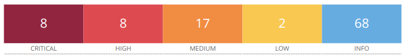
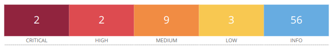

# Proyecto 4: Hunting Vulnerabilities

## Grupo 3

**Sergio Guerrero Merlo**

**Juan Manuel Cumbrera López**

**Christian Romero Oliva**

*1 De Abril de 2024*

## Resumen Ejecutivo

En este documento se presenta la evaluación básica inicial de dos de los servidores de la empresa contratante _SecureLogistics_ por parte del equipo de seguridad de nuestra empresa _NETMANCER Incorporated_.

El objetivo principal de este análisis ha sido comprobar si existen motivos para creer que dos de los servidores de _SecureLogistics_ presentan efectivamente problemas de seguridad grave, y como resultado final del análisis se concluye que efectivamente **sí existen**. 

A continuación se presenta un gráfico resumen con vulnerabilidades encontradas en las máquinas clasificadas por severidad:

**Servidor 1 con sistema operativo Windows:**

- Puntuación CVSS más alta: **9.8**

**Servidor 2 con sistema operativo Linux:**

- Puntuación CVSS más alta: **10**

Teniendo en cuenta que una vulnerabilidad con una puntuación _CVSS_ de **10** significa que, de explotarla, se alcanzaría un nivel de compromiso máximo en cuanto a la confidencialidad, integridad y disponibilidad de la información, podemos afirmar que estos dos servidores poseen efectivamente niveles críticos de riesgo.

En el presente informe se detalla más información sobre los resultados obtenidos.

## Introducción

Para este informe se nos solicitaba un análisis básico de dos servidores de la infraestructura de _SecureLogistics_. El motivo presentado fue la sospecha de posibles problemas de seguridad y el acotamiento de las mismas, para garantizar que se optimiza al máximo la inversión en seguridad necesaria para la empresa.

Es por ello que se decide realizar un escáner básico inicial para detectar las vulnerabilidades más 

...

### Objetivo

...

### Alcance

...

### Incidencias

...

## Metodología

...

## Resultados Obtenidos

...

## Conclusiones y Recomendaciones

...

## Glosario de Términos

...

## Anexos

...
