# Proyecto 4 de Hacking Ético - Comparativa de herramientas

## Introducción

En la parte 1 de este trabajo se ha ejecutado el escaneo de las máquinas Windows metasploitable 3 y Ubuntu metasploitable 3 a través de la herramienta Nessus. En esta parte del trabajo se ha realizado el mismo escáner con la herramienta Openvas conocida hoy en día como Greenbone.

Se ha generado por cada máquina una serie de reportes en pdf que serán los usados para la comparativa de ambas herramientas.

## Comparativa Windows Metasploitable 3 Nesuss VS Greenbone

La primera diferencia que podemos comprobar en los reportes generados, en la máquina metasploitable de Windows con Nessus agrupa las vulnerabilidades en 5 categorías.

Desde la categoría más alta que es la crítica hasta la más inferior llamada info, Nessus agrupa todas las vulnerabilidades que son iguales mostrandolas como una en el informe.

Como podemos ver en la imagen el primer escaneo de Nessus a la máquina de Windows indica que encuentra 8 vulnerabilidades clasificadas como críticas, 8 como altas, 17 como medio, 2 como bajas y 68 de información.

Sin embargo este mismo escaneo con Greenbone no nos indica que haya vulnerabilidades críticas. Greenbone las ha categorizado solo en alta, medio y bajas.

Ahora vamos a comparar las vulnerabilidades encontradas por cada uno. Lo primero que vamos a comparar son las vulnerabilidades críticas y altas encontradas ya que Greenbone no ha categorizado ninguna como crítica.

Nessus incluye en la categoria crítica aquellas vulnerabilidades cuando el CVSS es 10. De manera diferente, Greenbone incluye estas vulnerabilidades como altas como podemos ver en las dos siguientes capturas.
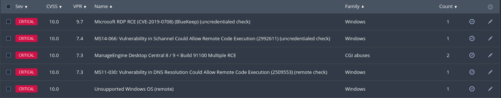
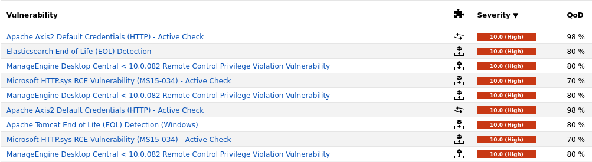

Como hemos visto anteriormente greenbone ha encontrado 95 vulnerabilidades en su escaneo siendo muy superior a la de Nessus. 
Por ejemplo, manage desktop central ha encontrado solamente dos vulnerabilidades altas y una crítica.

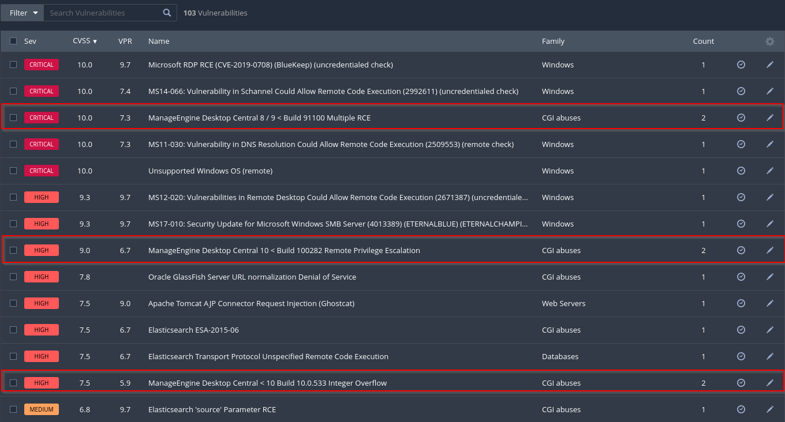

Mientras que en el caso de Greenbone ha encontrado una cantidad mayor dividiendo en distintas tipos de vulnerabilidades y en la misma vulnerabilidad para distintas versiones.

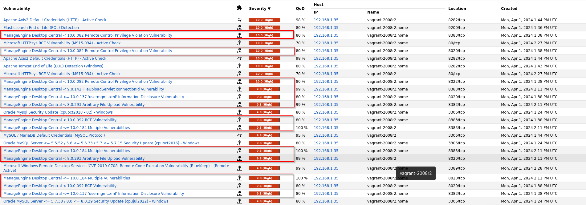

En el caso de las vulnerabilidades de nivel medio que las contabiliza desde el número de cvss 4 en ambas hasta el 6.9 de score. Al igual que en el apartado crítico y alto, ha encontrado más vulneralidades en Greenbone que en Nessus teniendo en cuenta las distintas vulnerabilidades con distintas versiones de la misma aplicación vulnerable.

Nessus ha encontrado solo 40 vulnerabilidades medias y Nessus ha encontrado como 152.

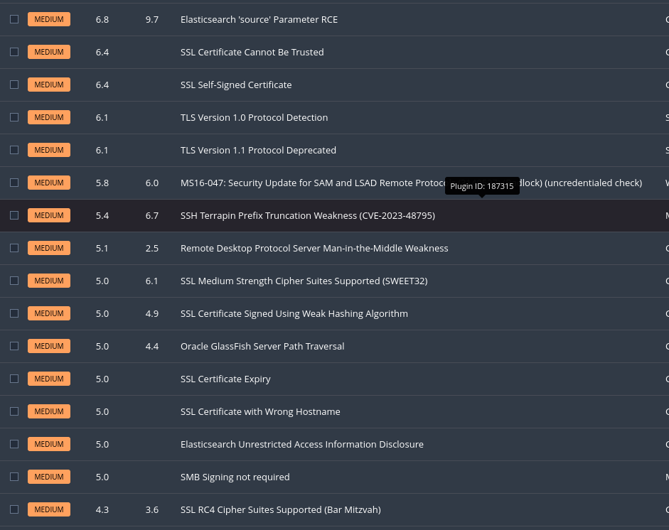
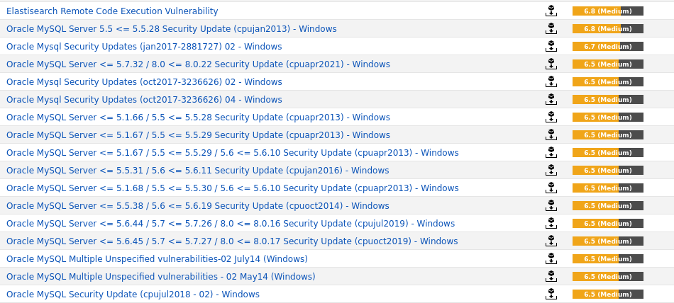

Esto pasa exactamente igual en las bajas siendo ambas desde el cvss 1 al 3.9. En este punto según Nessus solo existen tres vulnerabilidades bajas frente a las 13 de Greenbone.

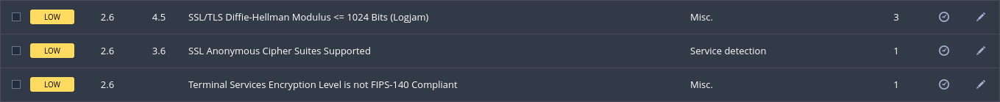
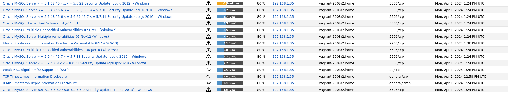

Además de esto, Nessus nos da una serie de información que ha conseguido al hacer el escaneo mientras que en Greenbone nos puede dar si existen los falsos positivos si existieran.

## Comparativa Ubuntu Metasploitable 3 Nesuss VS Greenbone

Ahora vamos a comparar ambos escaneos tanto de Nessus como de Greenbone. Aquí pasa exactamente igual que en el escaneo de Windows.

En Nessus encontramos menos vulnerabilidades que con Greenbone.

En Greenbone como podemos ver encontramos bastante más.

Haciendo una comparativa de las vulnerabilidades críticas y altas encontradas por Nessus podemos ver como en este caso hay una vulnerabilidad no encontrada en greenbone que si ha encontrado Nessus llamada Drupal Database Abstraction API SQLi con un CVSS de 7.5
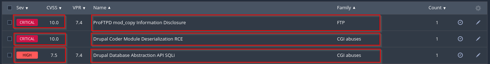

Sin embargo en Greenbone encontramos las dos críticas como altas y una serie de vulnerabilidades altas no mostradas en el escaneo de Nessus.
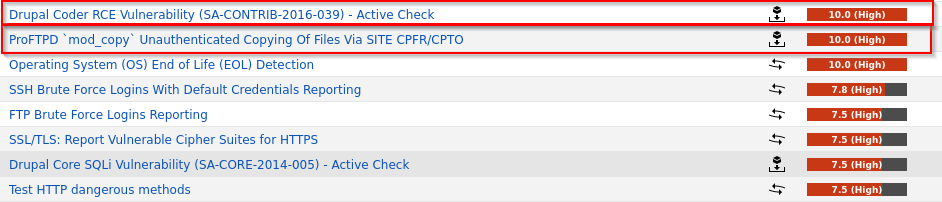

Comparando las vulnerabilidades medias y bajas de Nessus y Greenbone he encontrado una vulnerabilidad que Nessus a dividido en dos. Esta vulnerabilidad es la Weak Key Exchange Algorithms y con SSH.

Esta vulnerabilidad, nessus las ha categorizado como Low y le ha dado un CVSS de 2.6.

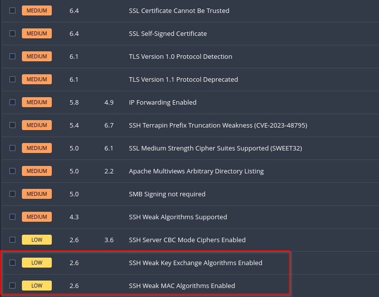

Sin embargo comparandolo con Greenbone, este ha incluido las dos vulnerabilidades en una sola vulnerabilidad con un score de 5.3.

Las demás vulnerabilidades encontradas en Greenbone no las ha encontrado Nessus.

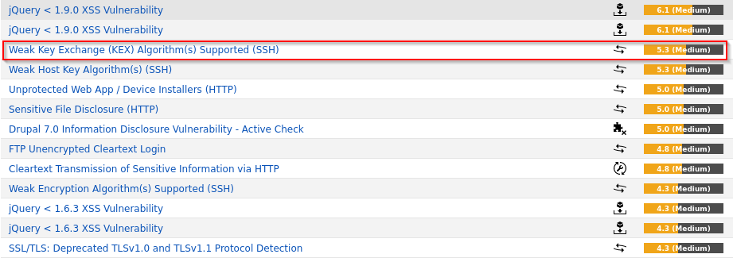

## Conclusión

En conclusión, Nessus y Greenbone categorizan y evaluan las vulnerabilidades de distinta forma.

El escaneo con Greenbone ha dado como resultado una mayor cantidad de vulnerabilidades. Cierto es que Greenbone divide una vulnerabilidad en varios tipos y para distintas versiones de la aplicación.

Ambas herramientas son muy útiles pero recomiendo siempre que se compruebe y se compare los resultados de ambas por si a alguna de las dos se les escapa alguna vulnerabilidad.